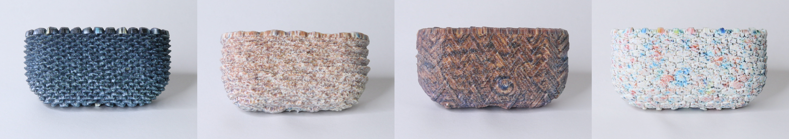

# TactStyle

**TactStyle: Generating Tactile Textures with Generative AI for Digital Fabrication**
Faraz Faruqi, Maxine Perroni-Scharf, Jaskaran Singh Walia, Yunyi Zhu, Shuyue Feng, Donald Degraen, Stefanie Mueller. *CHI '25.*

<p align="center">
  <a href="https://dl.acm.org/doi/10.1145/3706598.3713740"></a>
  <a href="https://groups.csail.mit.edu/hcie/files/research-projects/tactstyle/tactstyle.pdf"></a>
  <a href="https://www.youtube.com/watch?v=vIMCwYZR7wY&ab_channel=MITCSAIL"></a>
  <a href="https://groups.csail.mit.edu/hcie/files/research-projects/tactstyle/slides/chi-2025-tactstyle-presentation.pdf"></a>
</p>



TactStyle stylizes 3D models with image inputs while incorporating the
*tactile* properties of the texture in addition to its color. We accomplish
this by fine-tuning a Stable-Diffusion VAE to convert a texture's RGB diffuse
image into a grayscale heightfield, and then displacing the surface of a 3D
model along its vertex normals using that heightfield. The result is a 3D
model that visually matches the desired style and that physically reproduces
the tactile experience when 3D-printed.

> The visual stylization step in the paper uses Style2Fab and is not included
> here — this repository contains only TactStyle's geometry-stylization code.

## Repository layout

```
tactstyle/
├── src/
│   ├── model.py           Modified SD-VAE + heightfield head
│   ├── losses.py          SSIM loss
│   ├── dataset.py         (diffuse, height) dataset + MatSynth adapter
│   ├── train.py           Fine-tune the VAE on texture/height pairs
│   ├── inference.py       Generate a heightfield from a texture image
│   └── apply_texture.py   Displace a mesh along its normals using a heightfield
├── examples/
│   └── airpods/           §10.2 + Fig. 1 — AirPods case (stone-roof / rock variants)
├── figures/               Teaser figure used in the README
├── environment.yml        Conda environment (recommended)
├── requirements.txt       pip alternative
└── LICENSE                MIT
```

## Installation

```bash
git clone https://github.com/FarazFaruqi/TactStyle.git tactstyle
cd tactstyle

# Create the conda environment (Python 3.10 + PyTorch)
conda env create -f environment.yml
conda activate tactstyle
```

A CUDA-capable GPU is recommended. The conda environment installs PyTorch
from the official `pytorch` channel; the GPU build it ships with is
forward-compatible with most modern NVIDIA drivers (CUDA 11.8 — 12.x).
The SD v1.4 VAE is downloaded on first run by `diffusers` (~330 MB).

> A `requirements.txt` is also provided for the same
> dependency set:
>
> ```bash
> python -m venv .venv && source .venv/bin/activate
> pip install -r requirements.txt
> ```

## Dataset

The paper trains on **CGAxis "PBR 20 Parquets"** (commercial license), which
is **not** redistributed with this code. Two options:

1. **CGAxis** — purchase from <https://cgaxis.com/cgaxis_preview/PBR_20_Parquets/>
   and arrange textures as:

   ```
   <data_root>/
     4K_Physical_Parquets/<texture_name>/<texture_name>_diffuse.jpg
     4K_Physical_Parquets/<texture_name>/<texture_name>_height.jpg
     4K_Physical_Wood/...
     4K_Physical_Rocks/...
     4K_Physical_Walls/...
     4K_Physical_Roofs/...
   ```

2. **MatSynth** (CC-BY 4.0) — <https://gvecchio.com/matsynth>. A ~4k-material
   PBR dataset with diffuse and height maps. `src/dataset.py` ships a
   `MatSynthAdapter` showing the minimum interface required; swap it into
   `train.py` to fine-tune on MatSynth instead.

Any dataset providing aligned ``(diffuse RGB, height grayscale)`` pairs will
work — the code only assumes the dataset returns these as tensors.

## Quick start

### 1. Fine-tune the VAE on (diffuse, height) pairs

```bash
python -m src.train \
    --data-root  /path/to/textures \
    --save-dir   checkpoints \
    --epochs     60 \
    --batch-size 10 \
    --augment
```

Default hyper-parameters reproduce the paper:

* SD v1.4 VAE backbone with 4 added decoder layers + grayscale head
* Encoder frozen; only the decoder head + quant convs are trained
* RMSprop with `lr_existing=1e-5`, `lr_new=1e-3`
* Loss: `MSE + SSIM` (Section 5.2 of the paper). Weights default to 1.0
  each but are exposed as `--mse-weight` / `--ssim-weight` flags.
* `ReduceLROnPlateau` scheduler, gradient clipping at `max_norm=1.0`
* 90 / 10 train-test split, 4× rotational augmentation enabled by default
  (`--no-augment` to disable)

### 2. Generate a heightfield from a texture image

```bash
python -m src.inference \
    --checkpoint checkpoints/ckpt_vae_final.pth \
    --texture    path/to/texture.jpg \
    --output     heightfield.png
```

### 3. Apply the heightfield to a 3D model

```bash
python -m src.apply_texture \
    --mesh    examples/airpods/airpods.obj \
    --height  heightfield.png \
    --output  examples/airpods/airpods_styled.obj \
    --scale   0.05 \
    --remesh
```

`--remesh` runs PyMeshLab's isotropic remesher first (~25k faces, as in the
paper) so the heightfield has enough vertices to displace. The `--scale`
parameter is the *Texture Magnification Factor* from the Blender plugin
(Section 6.0.3); `0.05` is the value used for the application examples.

## Citation

```bibtex
@inproceedings{faruqi2025tactstyle,
  title     = {TactStyle: Generating Tactile Textures with Generative AI for Digital Fabrication},
  author    = {Faruqi, Faraz and Perroni-Scharf, Maxine and Walia, Jaskaran Singh and
               Zhu, Yunyi and Feng, Shuyue and Degraen, Donald and Mueller, Stefanie},
  booktitle = {CHI Conference on Human Factors in Computing Systems (CHI '25)},
  year      = {2025},
  doi       = {10.1145/3706598.3713740}
}
```

## Acknowledgments

This work was supported by the MIT-Google Program for Computing Innovation.
The fine-tuned model is built on the Stable Diffusion v1.4 VAE
([CompVis](https://huggingface.co/CompVis/stable-diffusion-v1-4)) loaded via
the [`diffusers`](https://github.com/huggingface/diffusers) library.

## License

MIT — see [`LICENSE`](LICENSE).
